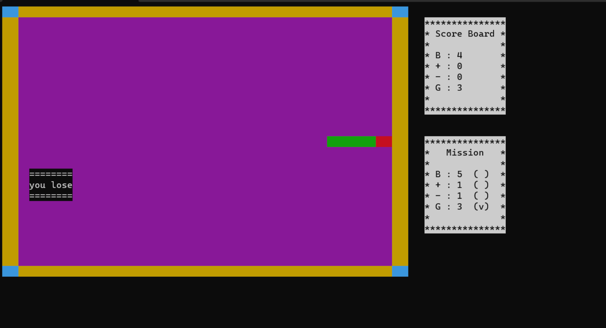

# Snake Game

> Ncurses를 사용하여 C++로 Snake Game 제작.

팀명 : 뱀 사냥꾼
팀원 : (김찬혁), (위승주), (이재석)


## 실행 방법

snake.cpp 와 snake 파일을 다운로드 받은 후 터미널 상에서 ./snake 명령어 입력 후 아무키나 입력하면 초기 화면이 아래 사진 처럼 나온다.



## 게임 룰

키보드의 조이스틱을 사용하여 조작한다.
↑ (위) , ← (왼쪽), → (오른쪽), ↓ (아래쪽).
머리가 꼬리가 있는 방향으로 이동하면 Lose.
스네이크 크기가 2개 이하 Lose.
벽에 박으면 Lose.

## 개발 환경 설정

터미널 혹은 WSL 사용

```sh
wget https://ftp.gnu.org/pub/gnu/ncurses/ncurses-6.2.tar.gz -P ~/Downloads
```

- 압축을 해제한 후 디렉터리가 있는 곳으로 이동 후 환경 설정
- 설치 시 make가 필요
  - 설치가 안되어 있는 경우 "sudo apt install make" 사용하여 설치 or "brew install make"
  - 설치확인은 make -v

```sh
./cofnigure

make

sudo make install

```

## 업데이트 내역

- 1.0
  - 수정: 문서 업데이트 (모듈 코드 동일)
- 1.1
  - 수정: `setDefaultXYZ()` 메서드 제거
  - 추가: `init()` 메서드 추가
- 1.2
     \* 버그 수정: `baz()` 메서드 호출 시 부팅되지 않는 현상 (@컨트리뷰터 감사합니다!)
- 1.3
  - 첫 출시
  - 수정: `foo()` 메서드 네이밍을 `bar()`로 수정
- 1.4
  - 작업 진행 중
